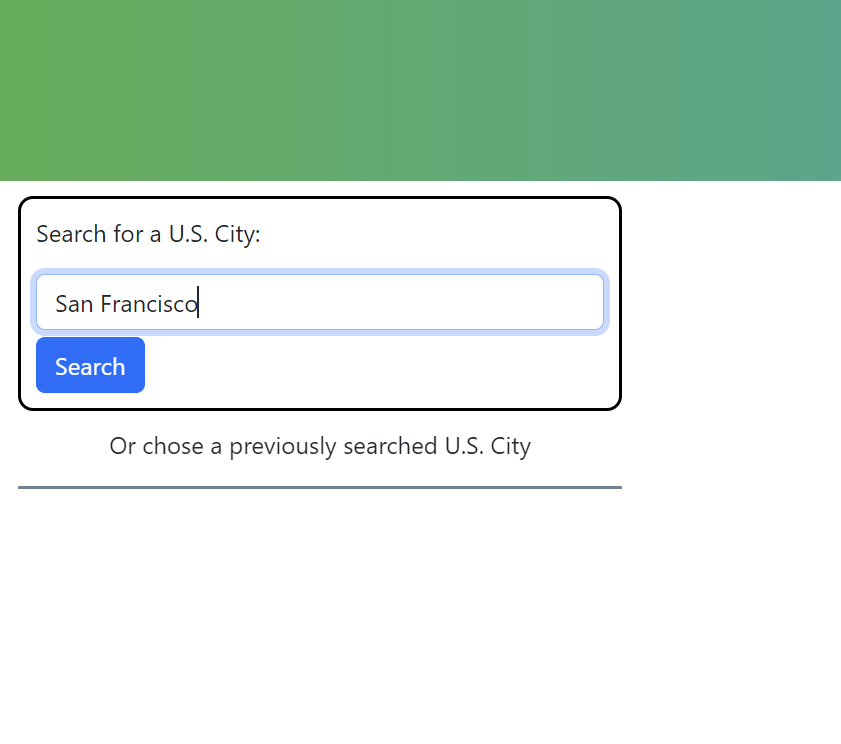
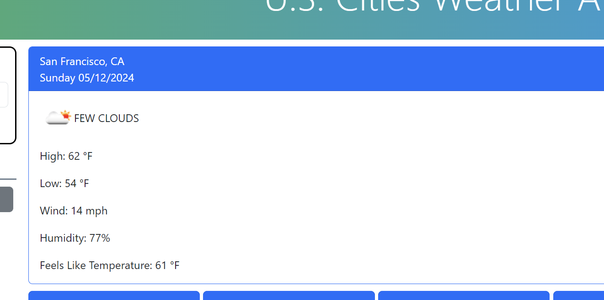
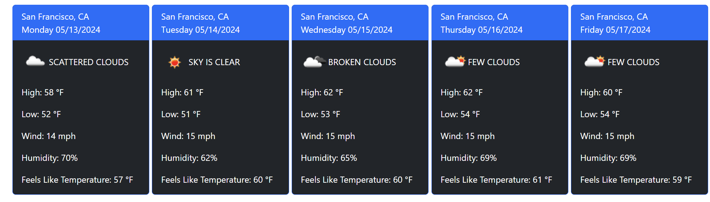
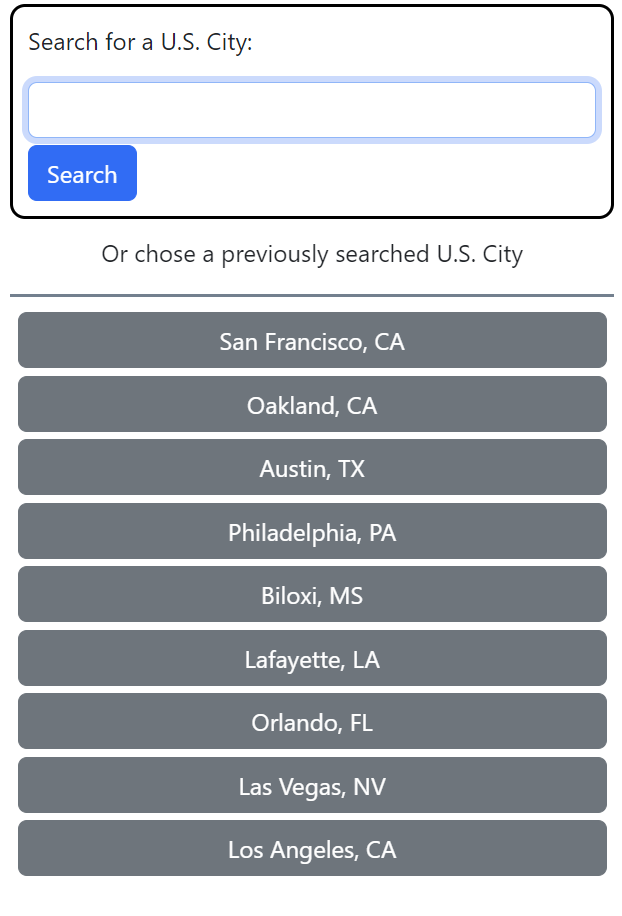
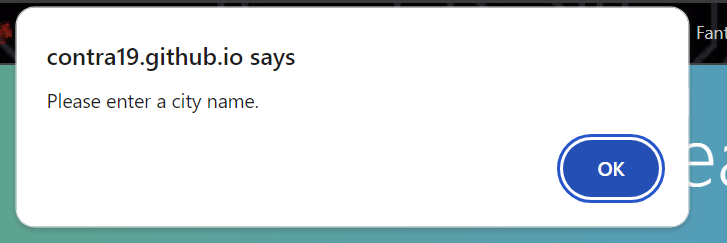
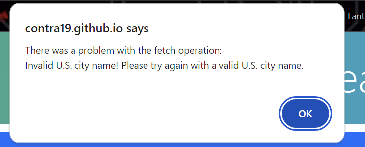
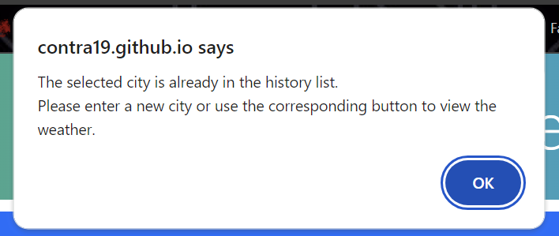

## Table of Contents

- [Introduction](#introduction)
- [Features](#features)
- [Getting Started](#getting-started)
  - [Prerequisites](#prerequisites)
  - [Installation](#installation)
- [Usage](#usage)
  - [Error Messages](#error-messages)
- [License](#license)
- [Acknowledgements](#acknowledgements)

## Introduction

# U.S. Cities Weather App

Welcome to the U.S. Cities Weather App! This web application allows users to search for weather forecasts for various U.S. cities. Users can search for a city by name, view the current weather, and see forecasts for the next five days. There is also a "City Buttons" feature that will allow the users to click on previously searched cities without having to search again.

## Features

- **City Search**: Users can search for U.S. cities by name using the search bar provided.
- **City Buttons**: Previously searched cities are saved as buttons for easy access.
- **Current Weather**: The main weather card displays the current weather information for the selected city.
- **Next 5 Days Forecast**: Five-day weather forecasts are displayed in individual cards below the main weather card.

This page is written with the following technologies:
- **HTML**
- **CSS**
- **JavaScript**
- **Bootstrap**
- **J-Query UI and Day.js**

## Getting Started

To get started with the U.S. Cities Weather App, follow these steps:

1. Clone this repository to your local machine.
2. Open the `index.html` file in your web browser.
3. Enter the name of a U.S. city in the search bar and click the "Search" button.
4. View the current weather information and forecast for the selected city.

### Prerequisites

- Modern web browser (Chrome, Firefox, Safari, Edge)
- Internet connection (for external resources)

### Installation

No installation is required. This app can be accessed at https://contra19.github.io/weather-app/.

## Usage

1. **Search for a City**: Enter the name of a U.S. city in the search bar and click the "Search" button.
  <figure>
    <figcaption>Use searchbox to find a U.S. city</figcaption>
    
  </figure>

2. **View Weather Information**: The main weather card will display the current weather information for the selected city.
  <figure>
    <figcaption>Current weather is displayed</figcaption>
    
  </figure>

3. **View Forecast**: Below the main weather card, you can view the forecast for the next five days.
  <figure>
    <figcaption>5 day forecast</figcaption>
    
  </figure>
  
4. **City Buttons**: City Buttons can be used to display cities that were already searched.
  <figure>
    <figcaption>City Buttons</figcaption>
    
  </figure>

### Error Messages

**If no city name is entered**: An error will be displayed stating you need to enter a city.
  <figure>
    <figcaption>No city entered</figcaption>
    
  </figure>

**If an invalid city name is entered**: An error will be displayed stating you need to enter a valid city name.
  <figure>
    <figcaption>No city entered</figcaption>
    
  </figure>

**If a city name is searched that is already in the city buttons list**: An error will be displayed stating you need to enter a different city or use the corresponding city button.
  <figure>
    <figcaption>Already searched city</figcaption>
    
  </figure>

## License

This project is licensed under the [MIT License](LICENSE).

## Acknowledgements

I would like to acknowledge my instructor Saia Founa for helping with troubleshooting and identification of issues. All code is original. ChatGPT was used for code validation.  

Please find below links to the 3rd party APIs that were used.
- Weather data and geolocation data provided by [OpenWeather](https://openweathermap.org/).
- [Bootstrap](https://getbootstrap.com/): A popular CSS framework for building responsive and mobile-first websites.
- [jQuery](https://jquery.com/): A fast, small, and feature-rich JavaScript library.
- [Day.js](https://day.js.org/): A minimalist JavaScript library for parsing, validating, manipulating, and formatting dates.